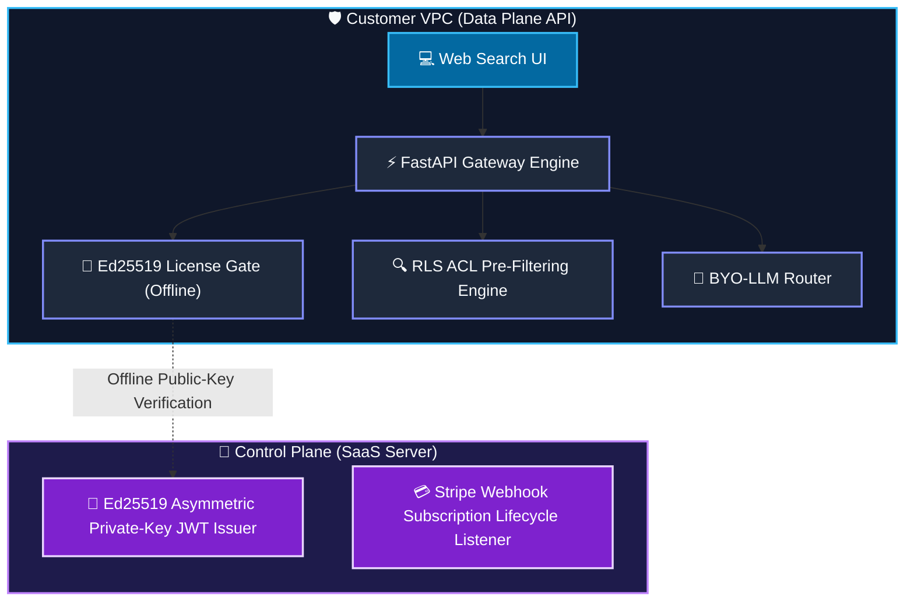
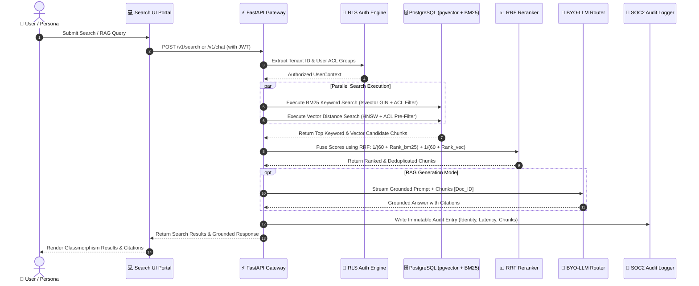
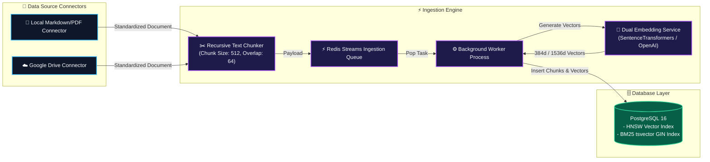

# Nucleus Architecture & Security Design Document

## 1. Overview & Vision
Nucleus is an **open-core, multi-tenant, permission-aware internal AI search engine** designed as a self-hosted alternative to Glean. It deploys 100% inside a customer's private VPC using **Podman** containers, allowing enterprise teams to bring their own LLM API keys and proxies while guaranteeing zero data egress to 3rd-party SaaS platforms.

---

## 2. Security & Air-Gapped License Validation



### Ed25519 Offline Validation Algorithm:
1. Control Plane generates an asymmetric Ed25519 key pair.
2. Control Plane signs license JWT tokens containing customer entitlement claims (`features: ["rbac", "audit_logs"]`).
3. Customer receives the JWT license key and configures the Data Plane with the Control Plane's **Public Key PEM**.
4. The Data Plane validates the signature using `cryptography.hazmat.primitives.asymmetric.ed25519`. **Zero outbound network calls** are required to validate license state.

---

## 3. Hybrid Search & RLS Query Execution Sequence



---

## 4. Asynchronous Document Ingestion Pipeline



---

## 5. Database Layer & PostgreSQL Pre-Filtered Hybrid Search

Nucleus utilizes **PostgreSQL 16 with pgvector** to provide unified relational storage, vector similarity, and BM25 full-text keyword search:

### Dual Indexing Strategy:
- **Vector Search**: `embedding vector(384)` column indexed with an HNSW graph (`vector_cosine_ops`).
- **Keyword Search**: `tsv tsvector` column indexed with a GIN index.

### Multi-Tenant Row-Level Security (RLS) & Pre-Filtering:
To prevent ACL leakage during HNSW graph traversal, Nucleus pre-filters vector queries using PostgreSQL array overlap operators:
```sql
SELECT chunk_id, content, title, 
       (embedding <=> :query_vector) AS distance
FROM document_chunks
WHERE tenant_id = :tenant_id
  AND acl_group_ids && :user_acl_groups
ORDER BY distance ASC
LIMIT 20;
```

### Reciprocal Rank Fusion (RRF):
BM25 keyword search ranks ($r_{bm25}$) and Cosine vector distance ranks ($r_{vec}$) are fused into a unified score:
$$RRF\_Score(d) = \frac{1}{60 + r_{bm25}(d)} + \frac{1}{60 + r_{vec}(d)}$$
