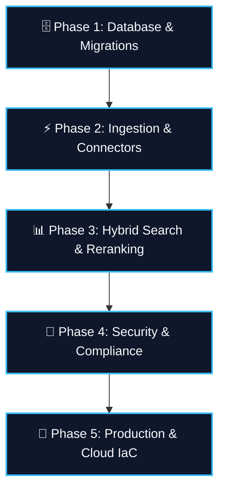

# Nucleus Backend Roadmap & TODO Plan

> **Comprehensive Engineering Checklist for Nucleus Enterprise AI Search Engine**

---

## 📌 Milestone Overview

---

## 🗄️ Phase 1: Database & Migration Engine

- [ ] **Alembic Migration Setup**
  - [x] SQLAlchemy async models for `Tenant`, `User`, `Document`, `DocumentChunk`, `AuditLog`.
  - [ ] Initialize Alembic (`alembic init -t async alembic`).
  - [ ] Create initial migration script (`001_initial_schema.py`) with `pgvector` & `tsvector` extensions.
  - [ ] Configure auto-migrations on container startup.

- [ ] **Database Seeding & Test Data**
  - [ ] Write `scripts/seed_db.py` to populate local Postgres with realistic multi-tenant data:
    - 🌐 **Public Engineering Docs** (Accessible by all roles).
    - ⚡ **Engineering Architecture Specs** (Accessible by `eng_lead` & `admin`).
    - 🔒 **HR Salary & Compensation** (Accessible by `hr_mgr` & `admin`).
  - [ ] Verify Row-Level Security (RLS) array overlap queries (`acl_group_ids && :user_acl_groups`).

- [ ] **Vector Index Optimization**
  - [ ] Tune HNSW graph parameters (`m=16`, `ef_construction=64`).
  - [ ] Benchmark cosine distance vs inner product for BGE-M3 & OpenAI `text-embedding-3-small`.

---

## ⚡ Phase 2: Ingestion Pipeline & Connectors

- [ ] **Pluggable Data Connectors**
  - [x] `LocalDirectoryConnector`: Markdown, Text, Code parsing.
  - [x] `GoogleDriveConnector`: Proof-of-concept stub.
  - [ ] `SlackConnector` (`data_plane/connectors/slack.py`): Fetch public & private channel message histories.
  - [ ] `JiraConnector` (`data_plane/connectors/jira.py`): Fetch Jira issues, epics, comments, and status transitions.
  - [ ] `ConfluenceConnector` (`data_plane/connectors/confluence.py`): Confluence workspace page ingestion.

- [ ] **Document Parsing & Chunking**
  - [x] `RecursiveTextChunker`: Split by paragraph, sentence, and word boundaries.
  - [ ] Add PDF & Docx text extractor (`pypdf` / `pdfplumber`).
  - [ ] Add code-aware AST chunker for Python, TypeScript, and Go repos.

- [ ] **Redis Ingestion Worker Resilience**
  - [x] Redis Stream producer & consumer loop.
  - [ ] Implement Dead-Letter Queue (DLQ) for failed chunk embeddings.
  - [ ] Exponential backoff retry logic for LLM rate-limit handling (`429 Too Many Requests`).

---

## 📊 Phase 3: Hybrid Search & Scoring Engine

- [ ] **Reciprocal Rank Fusion (RRF) Enhancements**
  - [x] Base RRF algorithm implementation ($k=60$).
  - [ ] Expose dynamic weighting coefficients ($\alpha \cdot RRF_{bm25} + \beta \cdot RRF_{vec}$).
  - [ ] Add Cross-Encoder Reranker stage (Cohere Rerink API or local `bge-reranker-large`).

- [ ] **Anti-Hallucination Grounding & RAG**
  - [x] Citation prompt formatting (`[Doc_ID: <id>]`).
  - [x] Streaming response support via Server-Sent Events (SSE).
  - [ ] Add query rewriting module (converts conversational queries into optimized BM25 + Vector queries).

- [ ] **Search Relevance Evaluation Suite**
  - [ ] Create `data_plane/search/evaluator.py`.
  - [ ] Measure NDCG@5, MRR (Mean Reciprocal Rank), and Precision@3 against golden test dataset.

---

## 🔐 Phase 4: Security, Auth & Compliance

- [ ] **Ed25519 License Engine**
  - [x] Ed25519 asymmetric JWT generation & air-gapped verification.
  - [x] License activation endpoint & feature gate middleware.
  - [ ] Add license expiration auto-check background task.
  - [ ] Implement graceful fallback to Community Edition upon license expiration.

- [ ] **Enterprise SSO & Authentication**
  - [ ] Integrate SAML 2.0 & OIDC provider (Okta, Azure AD, Auth0).
  - [ ] Auto-sync user ACL group memberships from IDP claims.

- [ ] **SOC2 Audit Log Management**
  - [x] Append-only audit logger model & FastAPI middleware.
  - [ ] Audit log export API (`GET /v1/audit/export?format=csv&start_date=...`).
  - [ ] Cryptographic hash chain for audit log tampering prevention.

---

## 🚀 Phase 5: Production Deployment & Cloud IaC

- [ ] **Container Optimization**
  - [x] Podman Compose local stack (`podman-compose.yml`).
  - [x] `Containerfile.api` & `Containerfile.control_plane`.
  - [ ] Multi-stage production container builds (<150MB image size).

- [ ] **Cloud Infrastructure (IaC)**
  - [x] Terraform AWS VPC & Podman EC2 host (`terraform/main.tf`).
  - [x] Fly.io configuration (`fly.toml`).
  - [ ] Add GCP Cloud Run Terraform deployment module (`terraform/gcp.tf`).

---

## 🧪 Phase 6: Automated Test Coverage

- [x] `tests/test_hybrid_search.py` - RRF score fusion verification.
- [x] `tests/test_rls_security.py` - SQL array overlap pre-filter security test.
- [x] `tests/test_byo_llm.py` - BYO-LLM routing & prompt formatting test.
- [x] `tests/test_license_gate.py` - Ed25519 offline verification test.
- [ ] End-to-end integration test (`tests/test_e2e_pipeline.py`): Ingest → Redis → Worker → Hybrid Search → Audit Log.
